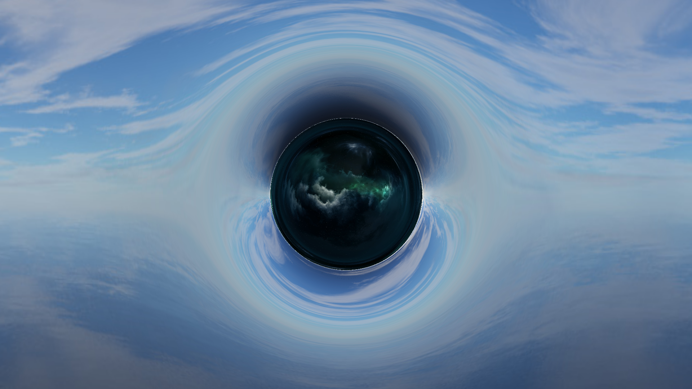

# Wormhole Raytracer
Final project of computer graphics course

Implementation of paper [Visualizing Interstellar's Wormhole](https://arxiv.org/pdf/1502.03809.pdf)

# Some tricks
- Only rays alone the equatorial plane is traced, special thanks to [Scott Manley](https://www.youtube.com/user/szyzyg/)

# How to use
- Change wormhole parameters (length, mass, radius) in [main.cc](main.cc):118
- Change image parameters (resolution, spp) in [main.cc](main.cc):18
- Change runge-kutta integration parameters (step size, total steps) in [WormholeODE.h](WormholeODE.h):206

# Images

